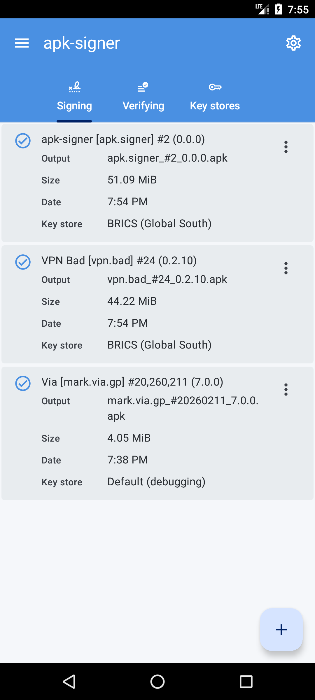
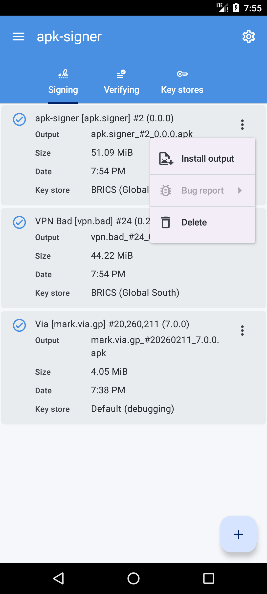
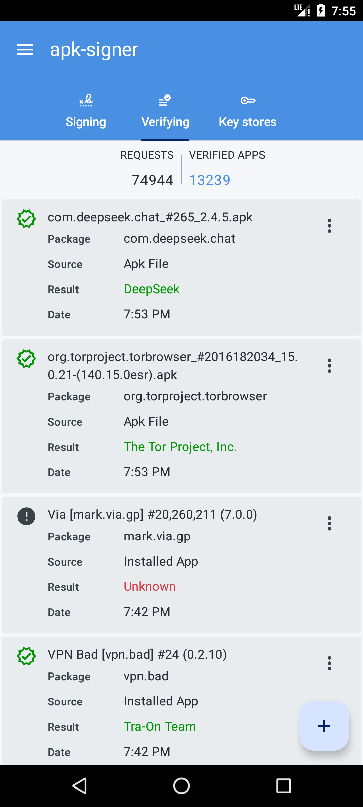
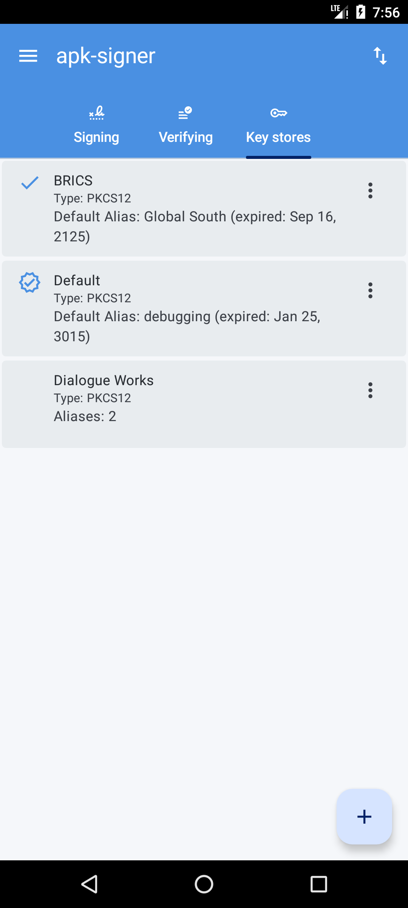
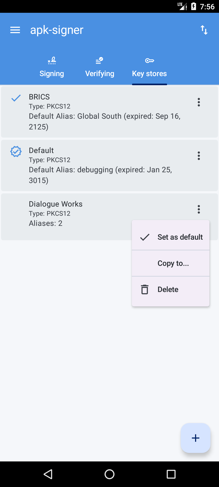
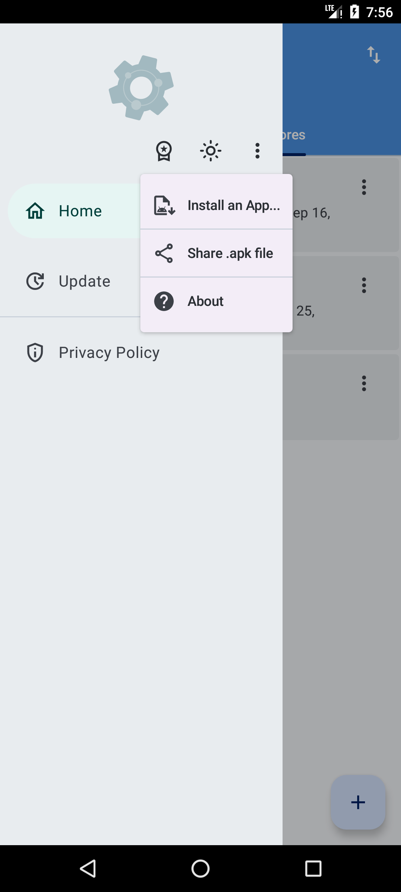
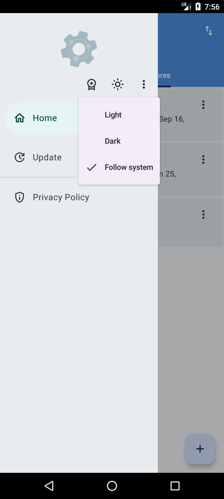
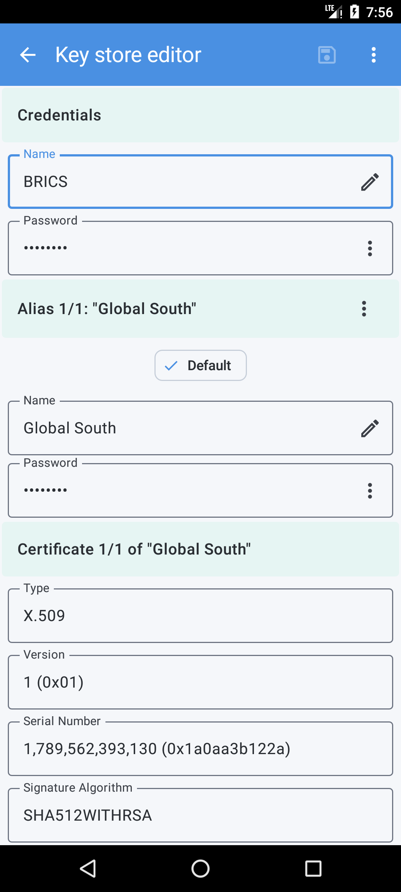

#   `apk-signer`

You can download original apk files here.  These are Amateur versions, which beats Play Store versions handily.  Play Store nowadays is just a 
bureaucratic place.

##  The new app

| Amateur Version        | Release Date |
| ---------------------- | ------------ |
| [`0.1.5` (`6`)][apk:6] | `2026-09-26` |

The "Play" version can be found here: <https://play.google.com/store/apps/details?id=apk.signer&hl=en>

### Android screenshots

##  The Legacy

| Amateur Version                | Release Date |
| ------------------------------ | ------------ |
| [`7.4.0` (`127`)][old-apk:127] | `2026-09-15` |

The Android app can be found here: <https://play.google.com/store/apps/details?id=com.haibison.apksigner&hl=en>

[apk:6]: https://drive.google.com/file/d/10kymHOLMlckJIa9WqzUZlKK35nU9Zc1M/view?usp=sharing

[old-apk:127]: https://drive.google.com/file/d/1KDxYhDTFvOsu1_4cGPWLsi2Tl8BnBFp-/view?usp=sharing
