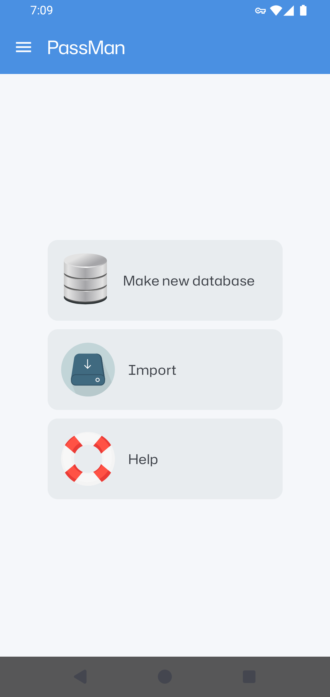
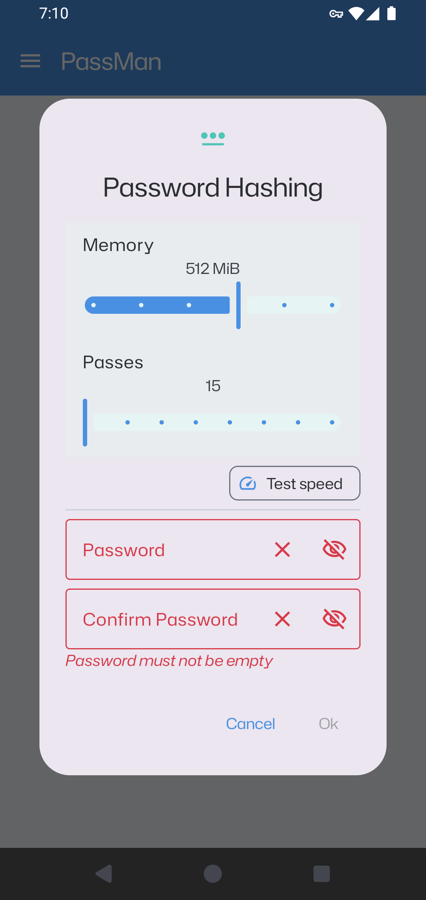
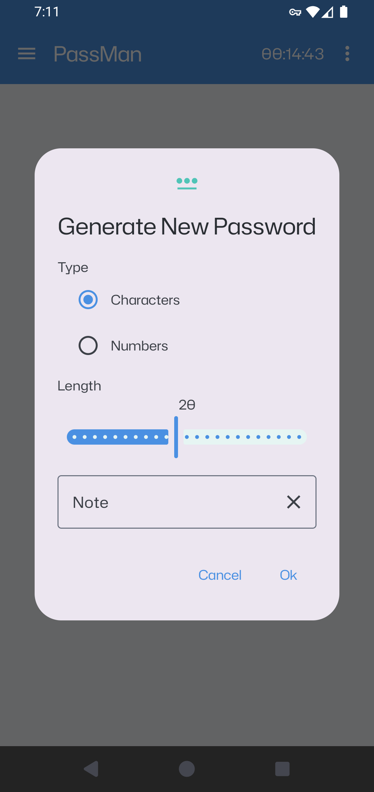
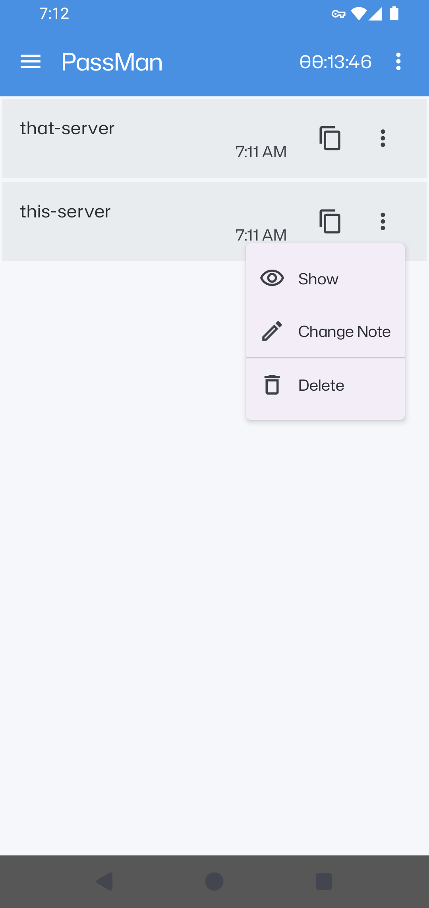
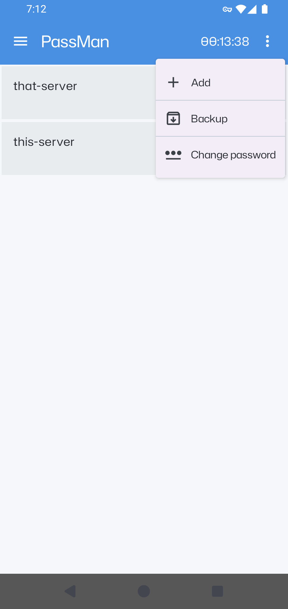

#   PassMan

PassMan is a simple password manager.

-   The app can generate random passwords. They will be stored and protected via your master password.
-   Your master password is hashed via [Argon2][site:argon2] password-hashing algorithm.
-   The hashed-password is then used to encrypt database via [XChaCha20-Poly1305][site:xchacha20-poly1305] algorithm.

Languages supported: Persian, Chinese, Russian, English.

##  Downloads

| Operating System | Version                             | Release Date | Notes
| ---------------- | ----------------------------------- | ------------ | -----
| Android          | [`0.2.8`/Internet][apk:auto-update] | `2026-03-04` | Internet permission is required for the auto-update functionality, which operates independently of any app store.
| Android          | [`0.2.8`][apk:no-internet]          | `2026-03-04` | No Internet permission needed. This file is a direct copy of the official Play Store release.

##  Android screenshots

[apk:auto-update]: https://drive.google.com/file/d/1izVGQWiU5LsSmAbyWshr9fYs3PnPZJUs/view?usp=sharing
[apk:no-internet]: https://drive.google.com/file/d/1IbZJ48Z060VUsBAILyP7k2Mq9S24ZCsc/view?usp=sharing
[site:argon2]: https://www.cryptolux.org/index.php/Argon2
[site:xchacha20-poly1305]: https://en.wikipedia.org/wiki/ChaCha20-Poly1305
