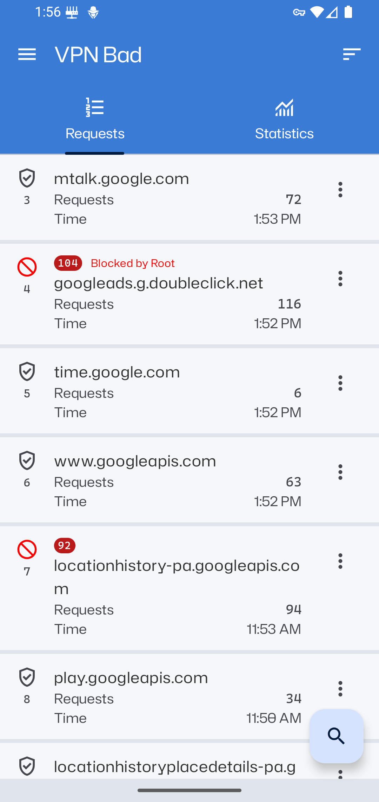
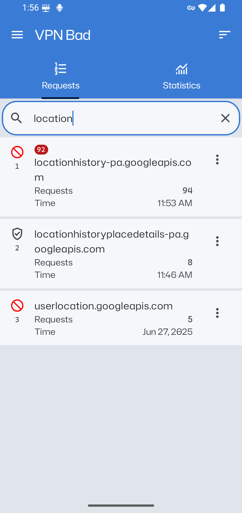
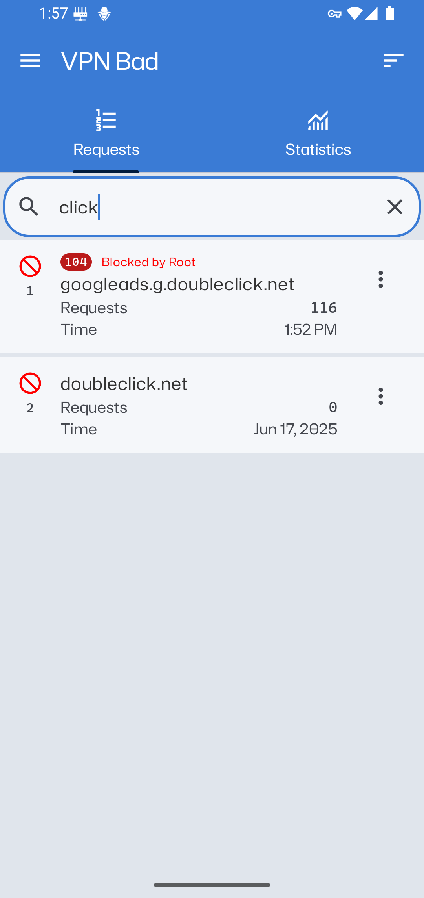
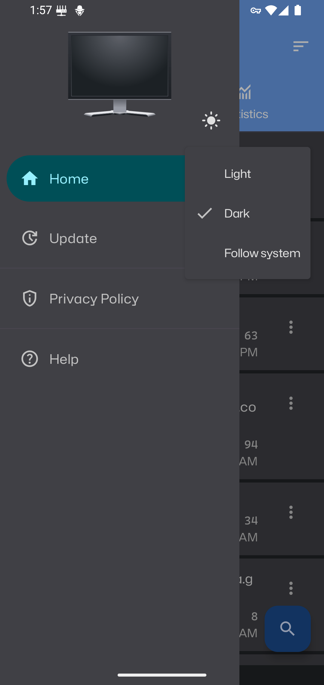
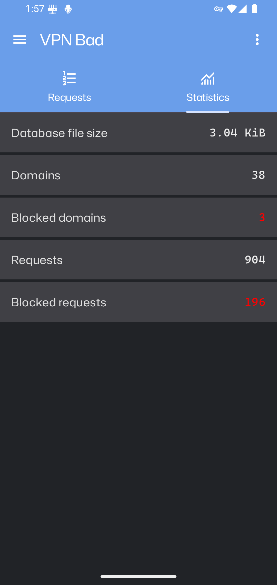
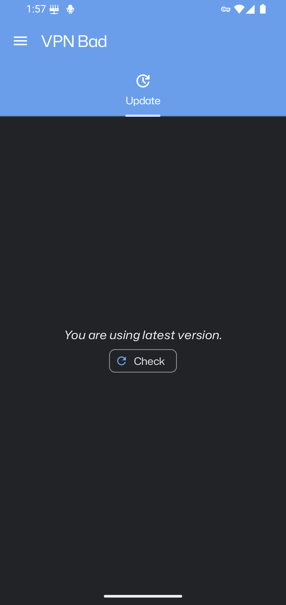
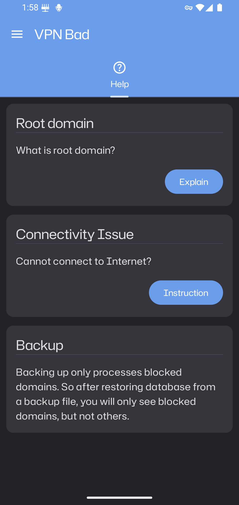

#   VPN Bad

A local VPN server which helps you manage Internet traffic coming out of your device.

-   Viewing which domains your device connects to.
-   Allowing you to block traffic to any domain.
-   Backing up/restoring database.
-   Auto-update.

Languages supported: Persian, Chinese, Russian, English.

##  Downloads

| Operating System | Version                   | Release Date |
| ---------------- | ------------------------- | ------------ |
| Android          | [`0.2.1`][apk:vpn-bad]    | `2026-05-26` |

##  Android screenshots

[apk:vpn-bad]: https://drive.google.com/file/d/1KhosHwShwhtW7-4OvH0tgHqsKhdUkPmB/view?usp=sharing
